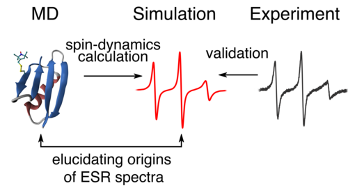

Structural and dynamic origins of ESR lineshapes in spin-labeled GB1 domain: the insights from spin dynamics simulations based on long MD trajectories
######################################################################################################################################################

This repo contains additional materials for the `paper <https://doi.org/10.1038/s41598-019-56750-y>`_ including:

- force field parameters for MTSL-labeled amino residues in amber format
- Amber MD protocols for written as python scripts using `pyrun <https://github.com/bionmr-spbu/pyrun>`_ library
- Initial MD pdb structures

